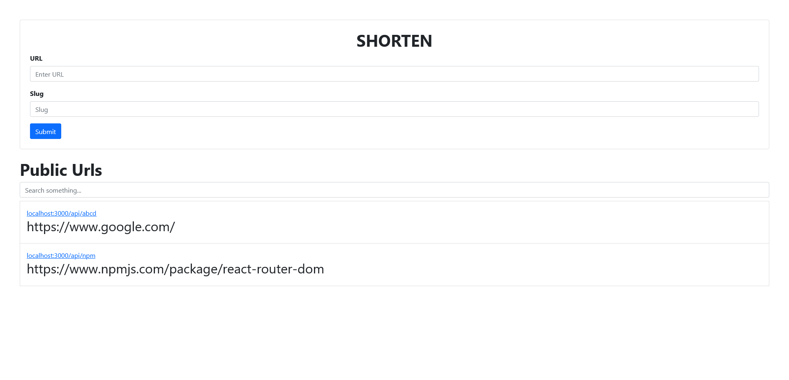

# SHORTEN

A simple web-based application that shortens and optimizes the Uniform Resource Locator's length for easier recall and tracing.



# Table of Contents

- [SHORTEN](#shorten)
- [Table of Contents](#table-of-contents)
- [Dependencies](#dependencies)
- [Setup](#setup)
- [Folder and File Structure](#folder-and-file-structure)
- [About the Developer](#about-the-developer)

# Dependencies

- bootstrap - 5.1.3
- eslint - 8.5.0
- eslint-config-airbnb - 19.0.2
- eslint-plugin-import - 2.25.3
- eslint-plugin-jsx-a11y - 6.5.1
- eslint-plugin-react - 7.28.0
- eslint-plugin-react-hooks - 4.3.0

# Setup

1. Install **Node JS**

   ```rest
    https://nodejs.org/en/download/
   ```

2. Install Dependencies

   ```bash
    $ npm install
   ```

3. Start

   ```bash
    $ npm start
   ```

# Folder and File Structure

- package.json - dependencies
- public - html and favicon
- src - code

# About the Developer

- Francis Rodrick M. Corpuz, https://github.com/f3nrisw0lf
- Neo Anthony G. Lapitan, https://github.com/seanteaman
